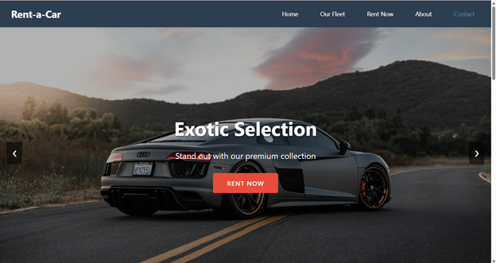
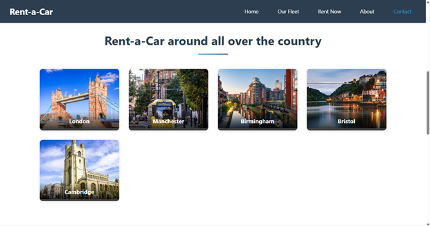
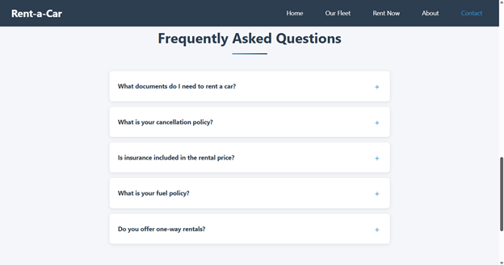

# Rent-a-Car: Premium Car Rental Service

## Overview
Rent-a-Car is a modern web application designed to provide a seamless car rental experience. The application features a responsive design, secure user authentication, and real-time booking management system.

## Features

### User Interface
- Interactive homepage with dynamic slideshow
- Responsive navigation menu
- Categorized car fleet display
- Real-time booking system
- User dashboard for booking history
- Password management functionality

### Main Homepage

The main landing page showcases our premium car selection with an elegant design and intuitive navigation menu.

### Homepage Features

Alternative view of the homepage highlighting special offers and featured vehicles available for rent.

### Fleet Gallery

Comprehensive display of our diverse vehicle fleet, categorized by type and featuring detailed specifications.

### About Us

Learn about our company's history, mission, and commitment to providing exceptional car rental services.

### Contact Information

Easy-to-use contact form and comprehensive information about our locations and support channels.

### Frequently Asked Questions

Detailed answers to common questions about our rental process, policies, and services.

### Authentication & Security
- Secure user registration and login
- Password hashing using bcrypt
- Session-based authentication
- Protected API endpoints

### Data Security Implementation

Demonstration of our robust security measures, including password hashing and secure data storage.

### Booking System
- Real-time car availability check
- Dynamic pricing calculation
- Secure payment processing
- Booking confirmation system
- Booking history tracking

### Booking Interface

User-friendly booking interface with real-time availability checking and seamless reservation process.

### Real-time Booking Management

Live demonstration of our booking management system showing real-time updates and reservation tracking.

### Administrative Features
- Car fleet management
- User management
- Booking records management
- Database administration

## Technical Stack

### Frontend
- HTML5
- CSS3
- JavaScript (ES6+)
- Font Awesome for icons

### Backend
- Node.js
- Express.js
- SQLite3 database
- bcrypt for password hashing
- Express Session for authentication

## Installation Guide

### Prerequisites
- Node.js (v14.0.0 or higher)
- npm (v6.0.0 or higher)

### Local Installation Steps

1. Clone the repository
   ```bash
   git clone https://github.com/your-username/rent-a-car.git
   cd rent-a-car
   ```

2. Install dependencies
   ```bash
   npm install
   ```

3. Set up the database
   ```bash
   # The database will be automatically initialized when you start the server
   # Initial schema and tables will be created
   ```

4. Start the server
   ```bash
   node server.js
   ```

5. Access the application
   - Open your browser and navigate to `http://localhost:3000`
   - The application will be running on port 3000 by default

## Remote Deployment

### Database Configuration
The application currently uses SQLite, which is suitable for local development. For production deployment, consider migrating to:
- PostgreSQL
- MySQL
- MongoDB

### Hosting Options
1. Backend Hosting:
   - Heroku
   - DigitalOcean
   - AWS
   - Railway

2. Frontend Hosting:
   - GitHub Pages
   - Netlify
   - Vercel

## Access Information

### Default Admin Credentials
- Username: admin
- Password: admin123
(Note: Change these credentials immediately after first login)

### Test User Credentials
- Username: testuser
- Password: test123

### API Endpoints

#### Authentication
- POST `/api/login` - User login
- POST `/api/register` - User registration
- POST `/api/logout` - User logout
- POST `/api/change-password` - Password change

#### Bookings
- GET `/api/cars` - Fetch available cars
- POST `/api/bookings` - Create new booking
- GET `/api/bookings/history` - Fetch booking history

## Security Considerations
1. Change default credentials immediately
2. Use HTTPS in production
3. Implement rate limiting
4. Regular security updates
5. Database backups


